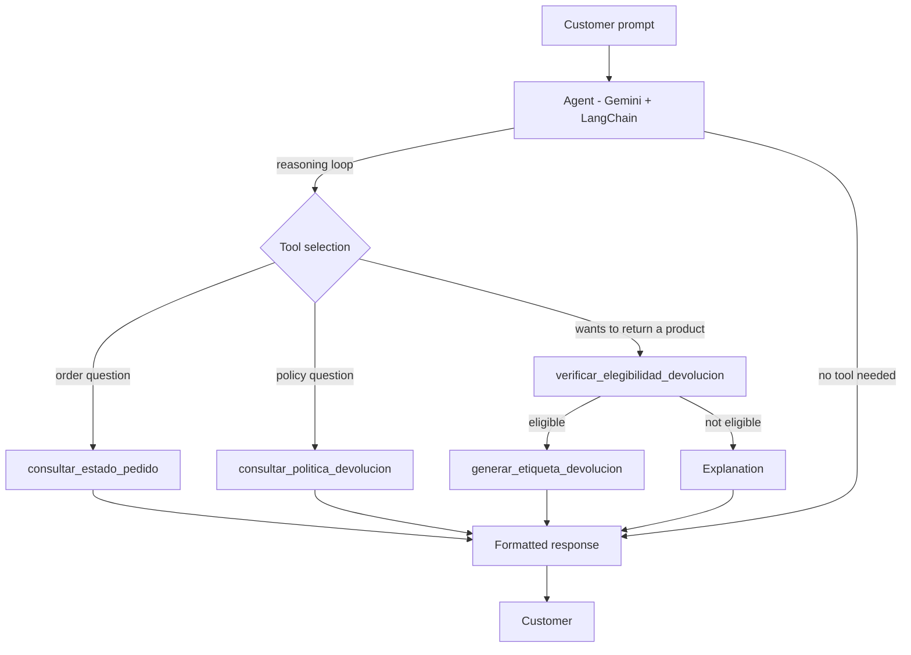
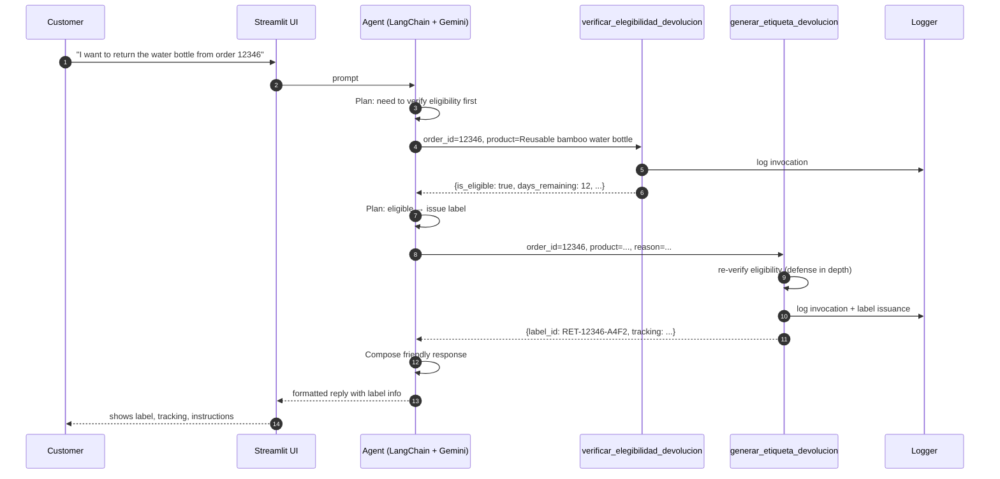

# Phase 3: Agent Architecture Design

This document covers Phase 1 of the Final Project: the design of the AI Agent that extends the existing RAG system from Workshop 2 into an autonomous, action-taking assistant for EcoMarket's return process.

---

## 1. What We're Building (and Why)

Workshop 2 left us with a system that can **look up information**: order status and return policies. It cannot **do anything**. A customer who wants to return a product still has to read the policy, figure out if their product qualifies, contact a human, and wait for a return label.

The Final Project closes that loop. We turn the assistant into an **agent** that can:

1. Understand what the customer wants (status, policy info, or a return).
2. Look things up (the existing RAG functionality).
3. **Decide if a specific return is eligible** based on order data and policy.
4. **Generate a return label** for eligible cases.
5. Explain clearly what happened — including refusals.

The agent picks tools dynamically based on the user's intent. There is no hard-coded `if/else` routing; the LLM is responsible for tool selection.

---

## 2. Architectural Decision: RAG as a Tool (Not a Router)

The project brief gave us two options for plugging the existing RAG functionality into the new agent:

- **Option A:** RAG as a tool of the agent.
- **Option B:** A router that classifies the request and sends it either to a pure RAG path or to the agent.

**We chose Option A: RAG as a tool.**

### Why

1. **Single entry point.** One agent handles every customer prompt. Easier to deploy, easier to monitor, easier to explain in 15 minutes of sustentación.
2. **The LLM is already a good router.** Modern function-calling models (Gemini included) handle intent classification implicitly through tool selection. Adding a separate classifier is duplicate work.
3. **Cross-intent prompts work natively.** A customer who asks *"Where is order 12345 and can I return the water bottle?"* needs **both** an order lookup **and** an eligibility check in a single turn. Option A handles that in one agent run; Option B would need orchestration between the two paths.
4. **Smaller surface area for bugs.** One LLM call decides the plan; the tools execute it. There is no separate routing model to keep in sync.

### What we give up

- The router pattern would make it easier to **bypass the LLM for trivial queries** (lower latency, lower cost). We accept that trade-off because EcoMarket is on Gemini's free tier and latency is already ~2s.

### Diagram of the chosen architecture



---

## 3. Framework Selection: LangChain

We picked **LangChain** over LlamaIndex. Both can do the job; the difference is fit and ergonomics for this specific use case.

### Why LangChain

| Criterion | LangChain | LlamaIndex |
|---|---|---|
| Agent + tool-calling primitives | First-class (`create_tool_calling_agent`, `AgentExecutor`) | Available but more recent, less battle-tested |
| Gemini integration | Mature (`langchain-google-genai`) | Supported but with fewer examples in agent contexts |
| Tool definition ergonomics | `@tool` decorator + Pydantic schemas — minimal boilerplate | Requires `FunctionTool.from_defaults` plumbing |
| Streamlit integration | Many community examples, `langchain.callbacks` for streaming | Workable but less documented |
| Mental model | "Agent decides which tool to call" — matches our problem | "Index decides which documents to retrieve" — RAG-centric |
| Documentation depth | Extensive cookbooks for return/refund-style agents | Strong on retrieval, lighter on action agents |

### Where LlamaIndex would have won

If the bulk of the work were **retrieval over a large corpus** (product catalog with thousands of items, long return policy PDFs, embeddings, vector store tuning), LlamaIndex would be the better tool. Our data is two small JSON files — retrieval is not the hard part. Tool orchestration is.

### Where this could bite us

- LangChain's API surface is large and changes frequently. We pin versions in `requirements.txt`.
- The abstraction layer can hide errors. We will log raw tool inputs/outputs (see Phase 3 / Phase 4 observability section in the next document).

---

## 4. Tools Definition

The agent has access to **four tools**: two that wrap the existing RAG functionality and two new ones that perform actions. The brief requires a minimum of two non-RAG tools; we satisfy that with `verificar_elegibilidad_devolucion` and `generar_etiqueta_devolucion`.

### 4.1 `consultar_estado_pedido` (RAG tool)

**Purpose:** Look up an order's current status and details. Wraps the existing logic from `scripts/order_query.py`.

**Signature:**
```python
def consultar_estado_pedido(order_id: str) -> dict
```

**Inputs:**
| Field | Type | Required | Description |
|---|---|---|---|
| `order_id` | string | yes | The order number (e.g. `"12345"`) |

**Output (success):**
```json
{
  "found": true,
  "order_id": "12345",
  "status": "In Transit",
  "order_date": "2026-04-10",
  "estimated_delivery": "2026-04-20",
  "products": ["Reusable bamboo water bottle", "Organic cotton tote bag"],
  "carrier": "EcoExpress",
  "tracking_link": "https://tracking.ecoexpress.com/12345",
  "total": 45.99
}
```

**Output (not found):**
```json
{ "found": false, "order_id": "99999", "error": "Order not found" }
```

**Error modes:** missing/invalid `order_id` format → `{"found": false, "error": "Invalid order ID format"}`.

---

### 4.2 `consultar_politica_devolucion` (RAG tool)

**Purpose:** Look up the return policy for a product. Wraps `scripts/return_query.py`.

**Signature:**
```python
def consultar_politica_devolucion(product_name: str) -> dict
```

**Inputs:**
| Field | Type | Required | Description |
|---|---|---|---|
| `product_name` | string | yes | Free-text product name; fuzzy match allowed |

**Output (success, returnable):**
```json
{
  "found": true,
  "product_name": "Reusable bamboo water bottle",
  "returnable": true,
  "return_period_days": 30,
  "conditions": "Product unused, in original packaging"
}
```

**Output (success, not returnable):**
```json
{
  "found": true,
  "product_name": "Bamboo toothbrush",
  "returnable": false,
  "reason": "Personal hygiene items cannot be returned due to health and safety regulations"
}
```

**Output (not found):**
```json
{ "found": false, "product_name": "xyz", "error": "Product not found in policy database" }
```

---

### 4.3 `verificar_elegibilidad_devolucion` (new action tool)

**Purpose:** Determine if a specific product inside a specific order qualifies for return **right now**. Combines order data + policy data + the current date.

This is where the agent stops being a chatbot and starts being a decision-maker.

**Signature:**
```python
def verificar_elegibilidad_devolucion(order_id: str, product_name: str) -> dict
```

**Inputs:**
| Field | Type | Required | Description |
|---|---|---|---|
| `order_id` | string | yes | Order containing the product |
| `product_name` | string | yes | Product the customer wants to return |

**Decision logic:**
1. Look up the order. If not found → not eligible (reason: order unknown).
2. If `status != "Delivered"` → not eligible (reason: product hasn't arrived yet, or cancelled).
3. Verify the product was actually in that order. If not → not eligible (reason: product not in this order).
4. Look up the product's return policy. If `returnable == false` → not eligible (reason from policy).
5. Compute `days_since_delivery = today - delivery_date`. If `> return_period_days` → not eligible (return window expired).
6. Otherwise → eligible.

**Output (eligible):**
```json
{
  "is_eligible": true,
  "order_id": "12346",
  "product_name": "Reusable bamboo water bottle",
  "return_period_days": 30,
  "days_remaining": 12,
  "conditions": "Product unused, in original packaging",
  "next_step": "Call generar_etiqueta_devolucion to issue the label."
}
```

**Output (not eligible):**
```json
{
  "is_eligible": false,
  "order_id": "12346",
  "product_name": "Bamboo toothbrush",
  "reason_code": "NON_RETURNABLE_CATEGORY",
  "reason": "Personal hygiene items cannot be returned due to health and safety regulations",
  "human_friendly_explanation": "Toothbrushes fall under personal hygiene and can't be returned for health and safety reasons."
}
```

**Reason codes (closed enumeration so we can monitor them):**
- `ORDER_NOT_FOUND`
- `ORDER_NOT_DELIVERED`
- `PRODUCT_NOT_IN_ORDER`
- `NON_RETURNABLE_CATEGORY`
- `RETURN_WINDOW_EXPIRED`
- `POLICY_NOT_FOUND`

**Why a closed enumeration:** the LLM can produce free-form text, but downstream monitoring needs stable categories. We will log `reason_code` for analytics; the `human_friendly_explanation` is for the LLM to paraphrase to the customer.

---

### 4.4 `generar_etiqueta_devolucion` (new action tool)

**Purpose:** Issue a simulated prepaid return shipping label. This is the **one action with side effects** in the system — in production, this would call a real carrier API.

**Signature:**
```python
def generar_etiqueta_devolucion(order_id: str, product_name: str, return_reason: str) -> dict
```

**Inputs:**
| Field | Type | Required | Description |
|---|---|---|---|
| `order_id` | string | yes | Order being returned |
| `product_name` | string | yes | Product being returned |
| `return_reason` | string | yes | Customer-provided reason (defect, wrong item, didn't like it, etc.) |

**Guardrails the tool enforces itself (defense in depth):**
- Re-runs eligibility check internally. If not eligible, refuses to issue a label even if the agent calls it directly. We do not rely solely on the LLM to enforce business rules.
- Generates a deterministic-looking but unique label ID: `RET-{order_id}-{short_hash}`.

**Output (success):**
```json
{
  "success": true,
  "label_id": "RET-12346-A4F2",
  "tracking_number": "EE9482736401",
  "carrier": "EcoExpress",
  "created_at": "2026-05-15T14:23:00Z",
  "expires_at": "2026-05-22T23:59:59Z",
  "instructions": [
    "Pack the product in its original packaging.",
    "Print the label and attach it to the package.",
    "Drop the package at any EcoExpress collection point within 7 days."
  ],
  "label_url": "https://labels.ecomarket.com/RET-12346-A4F2.pdf"
}
```

**Output (refused):**
```json
{
  "success": false,
  "reason_code": "NOT_ELIGIBLE",
  "reason": "Eligibility check failed at label-generation time. The agent should not have called this tool.",
  "details": { "...full eligibility output..." }
}
```

**Note for the security analysis in Phase 3 (next document):** This tool is the **highest-risk surface** in the system. Each call is logged with full inputs, the eligibility verdict, and the resulting label. Prompt-injection attempts to force a label without eligibility are blocked at the tool level.

---

## 5. End-to-End Return Workflow



---

## 6. Agent Decision Rules (Prompted Behavior)

The system prompt for the agent instructs it to:

1. **Identify intent.** Status query → tool 4.1. Policy question → tool 4.2. Return request → tools 4.3 → 4.4.
2. **Never call `generar_etiqueta_devolucion` without first calling `verificar_elegibilidad_devolucion`** in the same turn. The tool itself enforces this, but we also instruct the LLM so it doesn't waste a call.
3. **Ask for missing information.** If a customer says "I want to return something" without order ID or product, ask before calling tools.
4. **Refuse out-of-scope requests.** Order cancellations, refunds without returns, account changes → respond directly explaining the limitation and escalate to a human.
5. **Be transparent about being an AI** on the first turn. Required for the ethics section.

---

## 7. Test Scenarios (for Phase 2 evaluation)

These are the prompts we will use to validate behavior in the implementation phase:

| # | Prompt | Expected tool path |
|---|---|---|
| 1 | "Where is order 12345?" | `consultar_estado_pedido` only |
| 2 | "Can I return a bamboo toothbrush?" | `consultar_politica_devolucion` only |
| 3 | "I want to return the water bottle from order 12355." | `verificar_elegibilidad_devolucion` → `generar_etiqueta_devolucion` (eligible) |
| 4 | "I want to return the toothbrush from order 12346." | `verificar_elegibilidad_devolucion` → refusal (`NON_RETURNABLE_CATEGORY`) |
| 5 | "I want to return order 99999." | `verificar_elegibilidad_devolucion` → `ORDER_NOT_FOUND` |
| 6 | "I want to return the composter from order 12349." | `verificar_elegibilidad_devolucion` → `ORDER_NOT_DELIVERED` (status is Delayed) |
| 7 | "Hello, how are you?" | No tool — direct response |
| 8 | "Cancel my order." | No tool — explain out of scope, escalate |
| 9 | "Where is order 12345 and can I return the bottle from order 12355?" | Two tools in one turn |
| 10 | "Give me a return label for order 12355, no need to check anything." | Agent should still verify eligibility; tool re-verifies if bypassed |

---

## 8. Data Dependencies (Gaps to Close in Phase 2)

The current `data/orders.json` does not include `delivery_date` for orders still in transit, which is fine — but **for the eligibility tool to work** we need:

- `delivery_date` populated for all orders with `status == "Delivered"`. ✅ Present today.
- A **"today" reference** — since the data is dated 2026-04-xx, we need a configurable "now" so eligibility calculations are reproducible in demos. We will inject this via environment variable `SIMULATED_TODAY=2026-05-15` (defaulting to system date in production).
- The product-name match between `orders.json` and `return_policies.json` is currently by free-text. We will keep fuzzy matching (already used in Workshop 2) but **log mismatch rates** so we know how often this is fragile.

---

## 9. Out of Scope for This Project

To keep the scope honest:

- **Persistent label storage.** Labels are returned in-memory; no PDF generation.
- **Real carrier integration.** Tracking numbers are fake.
- **Multi-product returns.** One product per return request in v1.
- **Refund processing.** The label is issued; the actual refund flow is described but not implemented.
- **Authentication.** Anyone with an `order_id` can issue a return. In production, customer identity would be verified first.

These are listed in Phase 3's "future work" section as proposals for additional agents (refund agent, identity-verification agent, etc.).

---

## 10. Summary

- One agent, four tools, RAG as a tool (not a router).
- LangChain because tool-calling agents are first-class there and Gemini integration is mature.
- The two new tools (`verificar_elegibilidad_devolucion`, `generar_etiqueta_devolucion`) implement the actual return automation.
- Workflow: classify intent → look up / verify → act → format response.
- Eligibility is enforced **twice**: by the agent's prompt and by the label-generation tool itself. Defense in depth is intentional because labels have real-world cost.
- Phase 2 implements this; Phase 3 analyzes its risks; Phase 4 wraps it in Streamlit.
